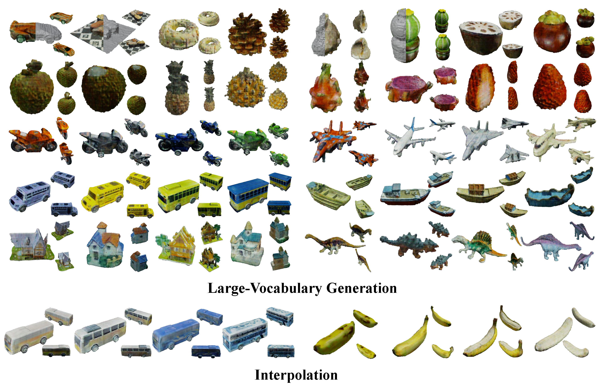

<div align="center">

<h1>Large-Vocabulary 3D Diffusion Model with Transformer</h1>

<div>
    <a href="https://ziangcao0312.github.io/" target="_blank">Ziang Cao</a><sup>1</sup>,
    <a href="https://hongfz16.github.io/" target="_blank">Fangzhou Hong</a><sup>1</sup>,
    <a href="https://wutong16.github.io/" target="_blank">Tong Wu</a><sup>2,3</sup>,
    <a href="https://github.com/paul007pl" target="_blank">Liang Pan</a><sup>1,3</sup>,
    <a href="https://liuziwei7.github.io/" target="_blank">Ziwei Liu</a><sup>1</sup>
</div>
<div>
    <sup>1</sup>S-Lab, Nanyang Technological University&emsp; <sup>2</sup>The Chinese University of Hong Kong; <sup>3</sup>Shanghai AI Laboratory
</div>
</br>
<strong>DiffTF can generate large-vocabulary 3D objects with rich semantics and realistic texture.</strong>

<div style="width: 100%; text-align: center; margin:auto;">
    
</div>
:open_book: For more visual results, go checkout our <a href="https://ziangcao0312.github.io/difftf_pages/" target="_blank">project page</a>
</div>

## Installation

Clone this repository and navigate to it in your terminal. Then run:

```python
bash install_difftf.sh
```

This will install the related python package that the scripts depend on.

## Preparing data

[ShapeNet]: dataset/ShapeNet/README.md
[OmniObject3D]: dataset/OmniObject3D/README.md

## Training 

#### I. Triplane fitting

##### 1. Training the shared decoder

```python
conda activate difftf
export CUDA_VISIBLE_DEVICES=0,1,2,3,4,5,6,7
#Omniobject3D
python -m torch.distributed.launch --nproc_per_node 8 ./Triplanerecon/train.py --config ./Triplanerecon/configs/omni/train.txt \\
--datadir ./dataset/Omniobject3D/renders \\# dataset path
--basedir ./Checkpoint \\# basepath
--expname omni_sharedecoder \\# the ckpt will save in ./Checkpoint/omni_sharedecoder
#ShapeNet
python -m torch.distributed.launch --nproc_per_node 8 ./Triplanerecon/train.py --config ./Triplanerecon/configs/shapenet_car/train.txt \\
--datadir ./dataset/ShapeNet/renders_car
--basedir ./Checkpoint \\# basepath
--expname shapenet_sharedecoder \\# the ckpt will save in ./Checkpoint/shapenet_car_sharedecoder
```

##### 2. Triplane fitting

```python
conda activate difftf
#Omniobject3D
python ./Triplanerecon/train_single_omni.py \\
--config ./Triplanerecon/configs/omni/train_single.txt \\ #config path
--num_gpu 1 --idx 0 \\ #using 1gpu to fit triplanes 
--datadir ./dataset/Omniobject3D/renders \\# dataset path
--basedir ./Checkpoint \\# basepath
--expname omni_triplane \\# triplanes will save in ./Checkpoint/omni_triplane
--decoderdir ./Checkpoint/omni_sharedecoder/300000.tar # ckpt of shared decoder

#ShapeNet
python ./Triplanerecon/train_single_shapenet.py \\
--config ./Triplanerecon/configs/shapenet_car/train_single.txt \\
--num_gpu 1 --idx 0 \\ #using 1gpu to fit triplanes 
--datadir ./dataset/ShapeNet/renders_car \\# dataset path
--basedir ./Checkpoint \\# basepath
--expname shapenet_triplane \\# triplanes will save in ./Checkpoint/shapenet_triplane
--decoderdir ./Checkpoint/shapenet_sharedecoder/300000.tar # ckpt of shared decoder

#Using 8 gpus
bash multi_omni.sh 8
#Using 8 gpus
bash multi_shapenet.sh 8
```

**Note**: We input the related hyperparameters and settings in the config files. You can find them in `./configs/shapenet` or  `./configs/omni`.

##### 3. Preparing triplane for diffusion

```python
#preparing triplanes for training diffusion
python ./Triplanerecon/extract.py 
--basepath ./Checkpoint/omni_triplane \\ # path of triplanes
--mode omni \\ # name of dataset (omni or shapenet)
--newpath ./Checkpoint/omni_triplane_fordiffusion #new path of triplanes
```

#### II. Training Diffusion

```python
cd ./3dDiffusion
export PYTHONPATH=$PWD:$PYTHONPATH
conda activate difftf
cd scripts
python image_train.py 
--datasetdir ./Checkpoint/omni_triplane_fordiffusion   #path to fitted triplanes 
--expname difftf_omni #ckpt will save in ./Checkpoint/difftf_omni
```

You may also want to train in a distributed manner. In this case, run the same command with `mpiexec`:

```python
mpiexec -n 8 python image_train.py 
--datasetdir ./Checkpoint/omni_triplane_fordiffusion   #path to fitted triplanes
--expname difftf_omni #ckpt will save in ./Checkpoint/difftf_omni
```

**Note**: Hyperparameters about training are set in `image_train.py` while hyperparameters about architecture are set in `./improved_diffusion/script_util.py`.

## Inference

#### I. Sampling triplane using trained diffusion

Our pre-trained model can be founded in [difftf_checkpoint/omni](https://entuedu-my.sharepoint.com/:f:/g/personal/ziang_cao_staff_main_ntu_edu_sg/ElQ-NvR_VH5JgxjNQyH_5NEBY9DWked5cy3_LoKpmR2KvA?e=c6T9mQ)

```python
python image_sample.py \\
--model_path ./Checkpoint/difftf_omni/model.pt  #checkpoint_path
--num_samples=5000
--save_path ./Checkpoint/difftf_omni # path of the generated triplanes
```

#### II. Rendering triplane using shared decoder

Our pre-trained share decoder can be founded in  [difftf_checkpoint/triplane](https://entuedu-my.sharepoint.com/:f:/g/personal/ziang_cao_staff_main_ntu_edu_sg/ElQ-NvR_VH5JgxjNQyH_5NEBY9DWked5cy3_LoKpmR2KvA?e=c6T9mQ)

```python
python ddpm_vis.py --config ./configs/omni/ddpm.txt
--ft_path ./Checkpoint/omni_triplane_fordiffusion/003000.tar #path of shared decoder
--triplanepath ./Checkpoint/difftf_omni/samples_5000x18x256x256.npz # path of generated triplanes
--basedir ./Checkpoint \\# basepath
--expname ddpm_omni_vis \\# triplanes will save in ./Checkpoint/omni_triplane
--mesh 0 \\# whether to save mesh
--testvideo \\# whether to save all images using video

python ddpm_vis.py --config ./configs/shapenet_car/ddpm.txt
--ft_path ./Checkpoint/shapenet_car_triplane_fordiffusion/003000.tar #path of shared decoder
--triplanepath ./Checkpoint/difftf_shapenet/samples_5000x18x256x256.npz # path of generated triplanes
--basedir ./Checkpoint \\# basepath
--expname ddpm_shapenet_vis \\# triplanes will save in ./Checkpoint/omni_triplane
--mesh 0 \\# whether to save mesh
--testvideo \\# whether to save all images using video
```

## References

If you find DiffTF useful for your work please cite:
```
@article{cao2023large,
  title={Large-Vocabulary 3D Diffusion Model with Transformer},
  author={Cao, Ziang and Hong, Fangzhou and Wu, Tong and Pan, Liang and Liu, Ziwei},
  journal={arXiv preprint arXiv:2309.07920},
  year={2023}
}
```
##### Acknowledgement

The code is implemented based on [improved-diffusion](https://github.com/openai/improved-diffusion) and [nerf-pytorch](https://github.com/yenchenlin/nerf-pytorch). We would like to express our sincere thanks to the contributors.

## :newspaper_roll: License

Distributed under the S-Lab License. See `LICENSE` for more information.

<a href="https://info.flagcounter.com/fLUn"></a>
